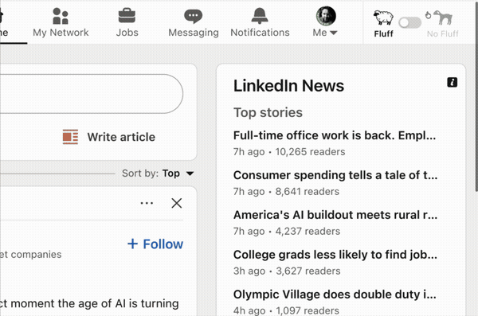

# Unfluff

> **Early preview** — this extension is under active development. Expect rough edges.

**Cut through LinkedIn noise.** Unfluff is a Chrome extension that uses AI to summarize and categorize LinkedIn feed posts so you can focus on what actually matters.

## How it works

Unfluff replaces the LinkedIn feed with a clean, minimalist reading experience. It analyzes each post and adds:

- A short plain-English summary
- A category tag (e.g. "hiring", "self-promo", "insight", "engagement bait")
- Visual indicators so you can skim your feed in seconds

No clutter, no sidebar noise, no suggested content — just the posts, distilled.

## Install

This extension is currently in early preview. To install it as an unpacked Chrome extension:

1. **Download this repo** — click the green **Code** button above, then **Download ZIP**. Extract the zip.

2. **Open Chrome Extensions** — navigate to `chrome://extensions` in your address bar.

3. **Enable Developer Mode** — toggle the switch in the top-right corner.

4. **Load the extension** — click **"Load unpacked"** and select the extracted folder (the one containing `manifest.json`).

5. **Browse LinkedIn** — open [linkedin.com](https://www.linkedin.com) and scroll your feed. Posts will be analyzed automatically.

> **Tip:** After loading, you should see the Unfluff icon in your Chrome toolbar. Click it to toggle analysis on/off.

## Updating

When a new version is available:

1. Download the latest ZIP from this repo
2. Extract and replace the old folder
3. Go to `chrome://extensions` and click the refresh icon on the Unfluff card

## Built by

[Standard Agents](https://standardagents.ai) — building AI agents that work.
